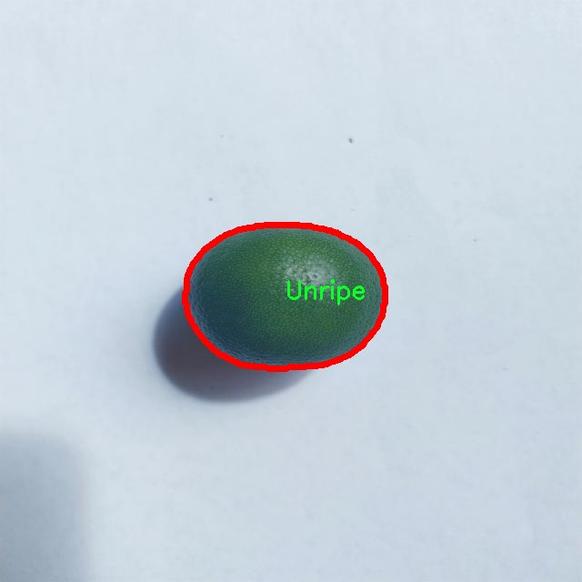

# 柑橘果实成熟度分割系统源码＆数据集分享
 [yolov8-seg-fasternet＆yolov8-seg-AIFI等50+全套改进创新点发刊_一键训练教程_Web前端展示]

### 1.研究背景与意义

项目参考[ILSVRC ImageNet Large Scale Visual Recognition Challenge](https://gitee.com/YOLOv8_YOLOv11_Segmentation_Studio/projects)

项目来源[AAAI Global Al lnnovation Contest](https://kdocs.cn/l/cszuIiCKVNis)

研究背景与意义

随着全球人口的不断增长和城市化进程的加快，农业生产面临着前所未有的挑战。柑橘类水果作为全球重要的经济作物之一，其生产与管理的效率直接影响到农民的收入和食品安全。在柑橘的种植过程中，果实的成熟度是影响其市场价值和销售时机的关键因素。传统的人工检测方法不仅耗时耗力，而且受主观因素影响较大，容易导致误判。因此，开发一种高效、准确的柑橘果实成熟度分割系统显得尤为重要。

近年来，计算机视觉和深度学习技术的迅猛发展为农业智能化提供了新的解决方案。YOLO（You Only Look Once）系列模型因其高效的实时目标检测能力而受到广泛关注。特别是YOLOv8模型，其在精度和速度上的优势使其成为图像分割和目标检测领域的热门选择。本研究旨在基于改进的YOLOv8模型，构建一个针对柑橘果实成熟度的分割系统，以实现对不同成熟度果实的自动识别和分类。

本研究所使用的数据集CITRUSCAN包含4900张柑橘果实的图像，涵盖了成熟度的三个主要类别：成熟（Ripe）、腐烂（Rotten）和未成熟（Unripe）。这些图像不仅数量充足，而且涵盖了不同光照、角度和背景下的果实图像，为模型的训练提供了丰富的样本。这一数据集的构建，旨在提高模型的泛化能力，使其能够在实际应用中更好地适应不同的环境和条件。

通过对YOLOv8模型的改进，我们可以在特征提取、网络结构和损失函数等方面进行优化，以提高模型在柑橘果实成熟度分割任务中的表现。例如，针对柑橘果实的特征，我们可以设计特定的卷积层和激活函数，以更好地捕捉果实的颜色、形状和纹理特征。同时，通过引入数据增强技术，可以有效提升模型的鲁棒性，减少过拟合现象。

本研究的意义不仅在于提升柑橘果实成熟度的检测精度，更在于推动农业智能化的发展。通过自动化的成熟度分割系统，农民可以实时获取果实的成熟状态，从而合理安排采摘时间，减少损失，提高产量。此外，该系统还可以为果品的分级和市场营销提供数据支持，助力农业产业链的优化与升级。

综上所述，基于改进YOLOv8的柑橘果实成熟度分割系统的研究，不仅具有重要的理论价值，也具有广泛的应用前景。它将为农业生产提供智能化的解决方案，推动农业的可持续发展，最终实现提高农民收入和保障食品安全的目标。

### 2.图片演示


##### 注意：由于此博客编辑较早，上面“2.图片演示”和“3.视频演示”展示的系统图片或者视频可能为老版本，新版本在老版本的基础上升级如下：（实际效果以升级的新版本为准）

  （1）适配了YOLOV8的“目标检测”模型和“实例分割”模型，通过加载相应的权重（.pt）文件即可自适应加载模型。

  （2）支持“图片识别”、“视频识别”、“摄像头实时识别”三种识别模式。

  （3）支持“图片识别”、“视频识别”、“摄像头实时识别”三种识别结果保存导出，解决手动导出（容易卡顿出现爆内存）存在的问题，识别完自动保存结果并导出到tempDir中。

  （4）支持Web前端系统中的标题、背景图等自定义修改，后面提供修改教程。

  另外本项目提供训练的数据集和训练教程,暂不提供权重文件（best.pt）,需要您按照教程进行训练后实现图片演示和Web前端界面演示的效果。

### 3.视频演示

[3.1 视频演示](https://www.bilibili.com/video/BV1iWmBYZE2v/)

### 4.数据集信息展示

##### 4.1 本项目数据集详细数据（类别数＆类别名）

nc: 3
names: ['Ripe', 'Rotten', 'Unripe']


##### 4.2 本项目数据集信息介绍

数据集信息展示

在现代农业生产中，柑橘类水果的成熟度评估是提高果品质量和市场竞争力的重要环节。为此，构建一个高效的果实成熟度分割系统显得尤为重要。本研究采用了名为“CITRUSCAN”的数据集，以改进YOLOv8-seg模型在柑橘果实成熟度分割任务中的表现。该数据集专门针对柑橘类水果的不同成熟状态进行了精心设计，旨在为计算机视觉领域的研究人员提供一个可靠的基础。

“CITRUSCAN”数据集包含三种主要的成熟度类别，分别为“Ripe”（成熟）、“Rotten”（腐烂）和“Unripe”（未成熟）。这三类标签不仅反映了柑橘果实的生长状态，也为后续的图像处理和深度学习模型训练提供了清晰的目标。每个类别的样本均经过严格筛选，确保数据的多样性和代表性，涵盖了不同品种、不同生长环境及不同光照条件下的柑橘果实图像。这种多样性使得模型在实际应用中能够更好地适应各种复杂的场景，提高了模型的泛化能力。

数据集中的图像数据经过高质量的标注，确保每一张图像都准确地反映了果实的成熟状态。标注过程不仅考虑了果实的外观特征，还结合了专家的经验，以确保数据的真实性和有效性。此外，数据集还提供了丰富的图像背景信息，包括果实的生长环境、光照条件以及可能的遮挡情况，这些信息对于训练一个鲁棒的分割模型至关重要。

在训练过程中，改进的YOLOv8-seg模型将利用“CITRUSCAN”数据集中的图像和标签信息，通过深度学习算法提取特征并进行学习。模型将通过多层卷积神经网络（CNN）对输入图像进行处理，逐步识别和分割出不同成熟度的柑橘果实。由于数据集的类别数量相对较少，模型在训练时能够快速收敛，并在验证集上实现较高的准确率和召回率。这为后续的实际应用奠定了坚实的基础。

此外，数据集的构建还考虑到了可扩展性和适应性。随着研究的深入，未来可以在“CITRUSCAN”数据集的基础上，增加更多的成熟度类别或扩展到其他水果的成熟度评估任务。这种灵活性使得数据集不仅适用于当前的研究需求，也为后续的研究提供了广阔的空间。

综上所述，“CITRUSCAN”数据集在柑橘果实成熟度分割任务中扮演着至关重要的角色。通过高质量的图像数据和精确的标注信息，该数据集为改进YOLOv8-seg模型提供了坚实的基础，推动了农业智能化和自动化的发展。随着技术的不断进步，基于该数据集的研究成果将有助于实现更高效的果实成熟度评估，进而提升农业生产的整体效率和经济效益。




### 5.全套项目环境部署视频教程（零基础手把手教学）

[5.1 环境部署教程链接（零基础手把手教学）](https://www.bilibili.com/video/BV1jG4Ve4E9t/?vd_source=bc9aec86d164b67a7004b996143742dc)


[5.2 安装Python虚拟环境创建和依赖库安装视频教程链接（零基础手把手教学）](https://www.bilibili.com/video/BV1nA4VeYEze/?vd_source=bc9aec86d164b67a7004b996143742dc)

### 6.手把手YOLOV8-seg训练视频教程（零基础小白有手就能学会）

[6.1 手把手YOLOV8-seg训练视频教程（零基础小白有手就能学会）](https://www.bilibili.com/video/BV1cA4VeYETe/?vd_source=bc9aec86d164b67a7004b996143742dc)


按照上面的训练视频教程链接加载项目提供的数据集，运行train.py即可开始训练



     Epoch   gpu_mem       box       obj       cls    labels  img_size
     1/200     0G   0.01576   0.01955  0.007536        22      1280: 100%|██████████| 849/849 [14:42<00:00,  1.04s/it]
               Class     Images     Labels          P          R     mAP@.5 mAP@.5:.95: 100%|██████████| 213/213 [01:14<00:00,  2.87it/s]
                 all       3395      17314      0.994      0.957      0.0957      0.0843

     Epoch   gpu_mem       box       obj       cls    labels  img_size
     2/200     0G   0.01578   0.01923  0.007006        22      1280: 100%|██████████| 849/849 [14:44<00:00,  1.04s/it]
               Class     Images     Labels          P          R     mAP@.5 mAP@.5:.95: 100%|██████████| 213/213 [01:12<00:00,  2.95it/s]
                 all       3395      17314      0.996      0.956      0.0957      0.0845

     Epoch   gpu_mem       box       obj       cls    labels  img_size
     3/200     0G   0.01561    0.0191  0.006895        27      1280: 100%|██████████| 849/849 [10:56<00:00,  1.29it/s]
               Class     Images     Labels          P          R     mAP@.5 mAP@.5:.95: 100%|███████   | 187/213 [00:52<00:00,  4.04it/s]
                 all       3395      17314      0.996      0.957      0.0957      0.0845


### 7.50+种全套YOLOV8-seg创新点代码加载调参视频教程（一键加载写好的改进模型的配置文件）

[7.1 50+种全套YOLOV8-seg创新点代码加载调参视频教程（一键加载写好的改进模型的配置文件）](https://www.bilibili.com/video/BV1Hw4VePEXv/?vd_source=bc9aec86d164b67a7004b996143742dc)

### 8.YOLOV8-seg图像分割算法原理

原始YOLOv8-seg算法原理

YOLOv8-seg算法是Ultralytics公司在2023年1月推出的YOLO系列的最新版本，旨在进一步提升目标检测和分割的性能。该算法在YOLOv7的基础上进行了多项创新和优化，特别是在网络结构、训练策略和特征提取方面。YOLOv8-seg不仅仅是一个目标检测模型，它还扩展了分割能力，使得算法能够在复杂场景中更精确地识别和分割目标物体。

首先，YOLOv8-seg采用了更深的卷积神经网络结构，这一结构设计使得模型能够提取更丰富的特征信息。与传统的YOLO系列相比，YOLOv8-seg在特征提取层引入了更为复杂的卷积层和激活函数，从而增强了模型对细节的捕捉能力。这种深层次的特征提取使得YOLOv8-seg在处理复杂背景和多目标情况下的表现更加出色，能够有效地减少误检和漏检的情况。

在输入处理方面，YOLOv8-seg依然保持了YOLO系列的核心思想，即将整个图像作为输入进行目标检测和分割。这种方法避免了传统方法中使用滑动窗口或区域提议的复杂性，显著提高了检测的速度和效率。YOLOv8-seg通过全图处理的方式，能够快速生成目标的边界框和分割掩码，这对于实时应用场景如智能监控和自动驾驶尤为重要。

YOLOv8-seg还引入了多尺度训练和测试的策略。这一策略允许模型在不同的尺度上进行训练，使得算法能够更好地适应各种尺寸的目标物体。这种多尺度的处理方式不仅提高了模型的鲁棒性，还在一定程度上提升了分割的精度。通过对不同尺度特征的融合，YOLOv8-seg能够更准确地定位和分割目标，尤其是在目标尺寸变化较大的情况下。

特征金字塔网络（FPN）的引入是YOLOv8-seg的又一重要创新。FPN通过构建多层次的特征图，能够有效地融合不同层次的特征信息，从而提升模型对小目标的检测能力。在YOLOv8-seg中，FPN的应用使得模型能够在处理复杂场景时，充分利用低层特征的细节信息和高层特征的语义信息，进一步提高了分割的精度和效果。

此外，YOLOv8-seg在损失函数的设计上也进行了优化。通过结合多种损失函数，YOLOv8-seg能够在训练过程中更好地平衡目标检测和分割的任务。这种优化使得模型在进行目标定位的同时，能够有效地进行像素级的分割，确保每个目标的边界更加清晰和准确。

YOLOv8-seg的应用场景非常广泛，包括智能监控、自动驾驶、医学影像分析等。其高精度和快速响应的特性，使得它在实时目标检测和分割任务中具有显著的优势。例如，在智能监控领域，YOLOv8-seg能够实时识别和分割监控画面中的人、车等目标，为安全监控提供了强有力的技术支持。在自动驾驶中，YOLOv8-seg能够帮助车辆识别道路上的行人、交通标志等重要信息，从而提高行车安全性。

总的来说，YOLOv8-seg算法通过深度卷积神经网络、多尺度训练、特征金字塔网络等一系列创新，极大地提升了目标检测和分割的性能。其在速度和精度上的双重优势，使得YOLOv8-seg成为当前目标检测领域的一项重要技术进展。随着YOLOv8-seg的不断发展和应用，未来在更多复杂场景中的应用潜力将会被进一步挖掘，为各行各业的智能化发展提供强有力的支持。


### 9.系统功能展示（检测对象为举例，实际内容以本项目数据集为准）

图9.1.系统支持检测结果表格显示

  图9.2.系统支持置信度和IOU阈值手动调节

  图9.3.系统支持自定义加载权重文件best.pt(需要你通过步骤5中训练获得)

  图9.4.系统支持摄像头实时识别

  图9.5.系统支持图片识别

  图9.6.系统支持视频识别

  图9.7.系统支持识别结果文件自动保存

  图9.8.系统支持Excel导出检测结果数据


### 10.50+种全套YOLOV8-seg创新点原理讲解（非科班也可以轻松写刊发刊，V11版本正在科研待更新）

#### 10.1 由于篇幅限制，每个创新点的具体原理讲解就不一一展开，具体见下列网址中的创新点对应子项目的技术原理博客网址【Blog】：


[10.1 50+种全套YOLOV8-seg创新点原理讲解链接](https://gitee.com/qunmasj/good)

#### 10.2 部分改进模块原理讲解(完整的改进原理见上图和技术博客链接)【如果此小节的图加载失败可以通过CSDN或者Github搜索该博客的标题访问原始博客，原始博客图片显示正常】

### YOLOv8简介
#### YOLOv8是什么？
YOLOv8是Ultralytics公司推出的基于对象检测模型的YOLO最新系列，它能够提供截至目前最先进的对象检测性能。

借助于以前的YOLO模型版本支持技术，YOLOv8模型运行得更快、更准确，同时为执行任务的训练模型提供了统一的框架，这包括：

目标检测
实例分割
图像分类
在撰写本文时，Ultralytics的YOLOv8存储库中其实还有很多功能有待添加，这包括训练模型的整套导出功能等。此外，Ultralytics将计划在Arxiv上发布一篇相关的论文，将对YOLOv8与其他最先进的视觉模型进行比较。

#### YOLOv8的新功能
Ultralytics为YOLO模型发布了一个全新的存储库（https://github.com/ultralytics/ultralytics）。该存储库被构建为用于训练对象检测、实例分割和图像分类模型的统一框架。

以下列举的是这个新版本的一些关键功能：

用户友好的API（命令行+Python）。
更快、更准确。
支持：
目标检测，
实例分割和
图像分类。
可扩展到所有以前的版本。
新的骨干网络。
新的Anchor-Free head对象检测算法。
新的损失函数。
此外，YOLOv8也非常高效和灵活，它可以支持多种导出格式，而且该模型可以在CPU和GPU上运行。

#### YOLOv8中提供的子模型


YOLOv8模型的每个类别中共有五个模型，以便共同完成检测、分割和分类任务。其中，YOLOv8 Nano是最快和最小的模型，而YOLOv8Extra Large（YOLOv8x）是其中最准确但最慢的模型。

YOLOv8这次发行中共附带了以下预训练模型：

在图像分辨率为640的COCO检测数据集上训练的对象检测检查点。
在图像分辨率为640的COCO分割数据集上训练的实例分割检查点。
在图像分辨率为224的ImageNet数据集上预处理的图像分类模型。
### 高效网络架构 CloAtt简介
众所周知，自从 ViTs 提出后，Transformer 基本横扫各大 CV 主流任务，包括视觉识别、目标检测和语义分割等。然而，一个比较棘手的问题就是这个架构参数量和计算量太大，所以一直被广受诟病。因此，后续有不少工作都是朝着这个方向去改进，例如 Swin-Transformer 在局部非重叠窗口中进行注意力计算，而 PVT 中则是使用平均池化来合并 token 以进一步压缩耗时。然而，这些 ViTs 由于其参数量太大以及高 FLOPs 并不适合部署到移动设备。如果我们直接缩小到适合移动设备的尺寸时，它们的性能又会显著降低。


#### MobileViT
因此，出现了不少工作聚焦于探索轻量级的视觉变换器，使 ViTs 适用于移动设备，CVHub 此前也介绍过不少的工作，大家有兴趣可以翻阅历史文章读读。例如，苹果团队提出的 MobileViT 研究了如何将 CNN 与 Transformer 相结合，而另一个工作 MobileFormer 则将轻量级的 MobileNet 与 Transformer 进行融合。此外，最新提出的 EdgeViT 提出了一个局部-全局-局部模块来聚合信息。以上工作的目标都是设计具有高性能、较少参数和低 FLOPs 的移动端友好型模型。


#### EdgeViT
然而，作者从频域编码的角度认为，在现有的轻量级模型中，大多数方法只关注设计稀疏注意力，以有效地处理低频全局信息，而使用相对简单的方法处理高频局部信息。具体而言，大多数模型如 EdgeViT 和 MobileViT，只是简单使用原始卷积提取局部表示，这些方法仅使用卷积中的全局共享权重处理高频本地信息。其他方法，如 LVT ，则是首先将标记展开到窗口中，然后使用窗口内的注意力获得高频信息。这些方法仅使用特定于每个 Token 的上下文感知权重进行局部感知。


#### LVT
虽然上述轻量级模型在多个数据集上取得了良好的结果，但没有一种方法尝试设计更有效的方法，即利用共享和上下文感知权重的优势来处理高频局部信息。基于共享权重的方法，如传统的卷积神经网络，具有平移等变性的特征。与它们不同，基于上下文感知权重的方法，如 LVT 和 NAT，具有可以随输入内容变化的权重。这两种类型的权重在局部感知中都有自己的优势。
#### NAT


受该博客的启发，本文设计了一种轻量级视觉变换器——CloAtt，其利用了上下文感知的局部增强。特别地，CloAtt 采用了双分支设计结构。
#### 局部分支
在局部分支中，本文引入了一个精心设计的 AttnConv，一种简单而有效的卷积操作符，它采用了注意力机制的风格。所提出的 AttnConv 有效地融合了共享权重和上下文感知权重，以聚合高频的局部信息。具体地，AttnConv 首先使用深度卷积（DWconv）提取局部表示，其中 DWconv 具有共享权重。然后，其使用上下文感知权重来增强局部特征。与 Non-Local 等生成上下文感知权重的方法不同，AttnConv 使用门控机制生成上下文感知权重，引入了比常用的注意力机制更强的非线性。此外，AttnConv 将卷积算子应用于 Query 和 Key 以聚合局部信息，然后计算 Q 和 K 的哈达玛积，并对结果进行一系列线性或非线性变换，生成范围在 [-1,1] 之间的上下文感知权重。值得注意的是，AttnConv 继承了卷积的平移等变性，因为它的所有操作都基于卷积。
#### 全局分支
在全局分支中则使用了传统的注意力机制，但对 K 和 V 进行了下采样以减少计算量，从而捕捉低频全局信息。最后，CloFormer 通过简单的方法将局部分支和全局分支的输出进行融合，从而使模型能够同时捕捉高频和低频信息。总的来说，CloFormer 的设计能够同时发挥共享权重和上下文感知权重的优势，提高其局部感知的能力，使其在图像分类、物体检测和语义分割等多个视觉任务上均取得了优异的性能。
如上图2所示，CloFormer 共包含一个卷积主干和四个 stage，每个 stage you Clo 模块 和 ConvFFN 组合而成的模块堆叠而成 。具体得，首先将输入图像通过卷积主干传递，以获取 token 表示。该主干由四个卷积组成，每个卷积的步长依次为2、2、1和1。接下来，tokens 经历四个 Clo 块和 ConvFFN 阶段，以提取分层特征。最后，再利用全局平均池化和全连接层生成预测结果。可以看出，整个架构非常简洁，支持即插即用！


#### ConvFFN
为了将局部信息融入 FFN 过程中，本文采用 ConvFFN 替换了常用的 FFN。ConvFFN 和常用的 FFN 的主要区别在于，ConvFFN 在 GELU 激活函数之后使用了深度卷积（DWconv），从而使 ConvFFN 能够聚合局部信息。由于DWconv 的存在，可以直接在 ConvFFN 中进行下采样而不需要引入 PatchMerge 模块。CloFormer 使用了两种ConvFFN。第一种是在阶段内的 ConvFFN，它直接利用跳跃连接。另一种是连接两个阶段的 ConvFFN，主要用于下采样操作。
#### Clo block
CloFormer 中的 Clo块 是非常关键的组件。每个 Clo 块由一个局部分支和一个全局分支组成。在全局分支中，我们首先下采样 K 和 V，然后对 Q、K 和 V 进行标准的 attention 操作，以提取低频全局信息。
虽然全局分支的设计能够有效减少注意力机制所需的浮点运算次数，并且能够获得全局的感受野。然而，它在处理高频局部信息方面的能力不足。为了解决这个问题，CloFormer 引入了局部分支，并使用 AttnConv 对高频局部信息进行处理。AttnConv 可以融合共享权重和上下文感知权重，能够更好地处理高频局部信息。因此，CloFormer 结合了全局和局部的优势来提高图像分类性能。下面我们重点讲下 AttnConv 。
#### AttnConv
AttnConv 是一个关键模块，使得所提模型能够获得高性能。它结合了一些标准的 attention 操作。具体而言，在AttnConv 中，我们首先进行线性变换以获得 Q、K和V。在进行线性变换之后，我们再对 V 进行共享权重的局部特征聚合。然后，基于处理后的 V 和 Q ，K 进行上下文感知的局部增强。具体流程可对照流程图理解，我们可以将其拆解成三个步骤。
#### Local Feature Aggregation
为了简单起见，本文直接使用一个简单的深度卷积（DWconv）来对 V 进行局部信息聚合。
#### Context-aware Local Enhancement
在将具有共享权重的局部信息整合到 V 中后，我们结合 Q 和 K 生成上下文感知权重。值得注意的是，我们使用了与局部自注意力不同的方法，该方法更加简洁。具体而言，我们首先使用两个 DWconv 对 Q 和 K 分别进行局部信息聚合。然后，我们计算 Q 和 K 的 Hadamard 乘积，并对结果进行一系列转换，以获取在 -1 到 1 之间的上下文感知权重。最后，我们使用生成的权重来增强局部特征。
#### Fusion with Global Branch
在整个 CloFormer 中，我们使用一种简单直接的方法来将局部分支和全局分支的输出进行融合。具体而言，本文是通过将这两个输出在通道维度上进行直接拼接，然后再通过一个 FC 层聚合这些特征并结合残差输出。
最后，上图展示了三种不同的方法。相比于传统卷积，AttnConv 中的上下文感知权重使得模型能够更好地适应输入内容。相比于局部自注意力机制，引入共享权重使得模型能够更好地处理高频信息，从而提高性能。此外，生成上下文感知权重的方法引入了更强的非线性性，也提高了性能。需要注意的是，AttnConv 中的所有操作都基于卷积，保持了卷积的平移等变性特性。


### 11.项目核心源码讲解（再也不用担心看不懂代码逻辑）

#### 11.1 ultralytics\utils\files.py

以下是对代码中最核心部分的提炼和详细注释：

```python
import os
from pathlib import Path
from contextlib import contextmanager

@contextmanager
def spaces_in_path(path):
    """
    处理路径中包含空格的上下文管理器。如果路径包含空格，将其替换为下划线，
    复制文件/目录到新路径，执行上下文代码块，然后将文件/目录复制回原位置。

    参数:
        path (str | Path): 原始路径。

    返回:
        (Path): 如果路径中有空格，则返回替换空格为下划线的临时路径，否则返回原始路径。
    """
    if ' ' in str(path):
        path = Path(path)  # 转换为Path对象
        with tempfile.TemporaryDirectory() as tmp_dir:  # 创建临时目录
            tmp_path = Path(tmp_dir) / path.name.replace(' ', '_')  # 新路径

            # 复制文件或目录
            if path.is_dir():
                shutil.copytree(path, tmp_path)  # 复制目录
            elif path.is_file():
                tmp_path.parent.mkdir(parents=True, exist_ok=True)  # 创建父目录
                shutil.copy2(path, tmp_path)  # 复制文件

            try:
                yield tmp_path  # 返回临时路径
            finally:
                # 将文件/目录复制回原位置
                if tmp_path.is_dir():
                    shutil.copytree(tmp_path, path, dirs_exist_ok=True)
                elif tmp_path.is_file():
                    shutil.copy2(tmp_path, path)

    else:
        yield path  # 如果没有空格，直接返回原路径


def increment_path(path, exist_ok=False, sep='', mkdir=False):
    """
    增加文件或目录路径的后缀，例如将 'runs/exp' 增加为 'runs/exp2', 'runs/exp3' 等。

    参数:
        path (str, pathlib.Path): 要增加的路径。
        exist_ok (bool, optional): 如果为True，路径不会增加，直接返回原路径。默认为False。
        sep (str, optional): 路径和增加数字之间的分隔符。默认为''。
        mkdir (bool, optional): 如果路径不存在，是否创建目录。默认为False。

    返回:
        (pathlib.Path): 增加后的路径。
    """
    path = Path(path)  # 转换为Path对象
    if path.exists() and not exist_ok:
        path, suffix = (path.with_suffix(''), path.suffix) if path.is_file() else (path, '')

        # 增加路径
        for n in range(2, 9999):
            p = f'{path}{sep}{n}{suffix}'  # 生成新路径
            if not os.path.exists(p):  # 检查路径是否存在
                break
        path = Path(p)

    if mkdir:
        path.mkdir(parents=True, exist_ok=True)  # 创建目录

    return path  # 返回增加后的路径


def file_size(path):
    """返回文件或目录的大小（MB）。"""
    if isinstance(path, (str, Path)):
        mb = 1 << 20  # 1 MB = 1024 * 1024 bytes
        path = Path(path)
        if path.is_file():
            return path.stat().st_size / mb  # 返回文件大小
        elif path.is_dir():
            return sum(f.stat().st_size for f in path.glob('**/*') if f.is_file()) / mb  # 返回目录下所有文件的大小
    return 0.0  # 如果路径无效，返回0
```

### 核心部分说明：
1. **`spaces_in_path`**: 这个上下文管理器处理路径中包含空格的情况，确保在处理时不会因为空格导致路径错误。它会在执行代码块前复制文件或目录到一个临时路径，并在代码块执行完后将其复制回原位置。

2. **`increment_path`**: 这个函数用于生成一个新的文件或目录路径，如果路径已存在，可以通过增加数字来避免冲突。它提供了灵活的选项来控制是否创建目录以及如何处理已有路径。

3. **`file_size`**: 这个函数计算并返回指定文件或目录的大小，以MB为单位。它支持处理文件和目录，并能够递归计算目录下所有文件的总大小。

这些功能在文件管理和路径处理时非常有用，尤其是在处理大量文件和目录时。

这个文件是Ultralytics YOLO项目中的一个工具模块，主要用于处理文件和目录的操作。它包含了一些类和函数，帮助用户在处理文件时更加方便和高效。

首先，文件中定义了一个`WorkingDirectory`类，这个类是一个上下文管理器，允许用户在指定的工作目录中执行代码。通过使用`@WorkingDirectory(dir)`装饰器或`with WorkingDirectory(dir):`语句，用户可以临时更改当前工作目录，并在代码块执行完毕后自动恢复到原来的目录。这对于需要在特定目录下执行文件操作的场景非常有用。

接下来，定义了一个名为`spaces_in_path`的上下文管理器。这个管理器用于处理路径中包含空格的情况。如果路径中有空格，它会将空格替换为下划线，并将文件或目录复制到新的路径中执行代码块，最后再将文件或目录复制回原来的位置。这种处理方式可以避免在某些操作中因路径包含空格而导致的问题。

文件中还有一个`increment_path`函数，用于递增文件或目录的路径。这个函数会检查指定的路径是否存在，如果存在且`exist_ok`参数为`False`，则会在路径后面添加一个数字后缀（例如`runs/exp2`、`runs/exp3`等）。如果指定的路径是一个文件，它会保留文件的扩展名；如果是目录，则直接在路径后添加数字。该函数还可以根据`mkdir`参数创建目录。

此外，文件中还定义了几个用于获取文件信息的函数，包括`file_age`、`file_date`和`file_size`。`file_age`函数返回自上次修改以来的天数，`file_date`函数返回可读的文件修改日期，而`file_size`函数则返回文件或目录的大小（以MB为单位）。这些函数可以帮助用户快速获取文件的基本信息。

最后，`get_latest_run`函数用于查找指定目录下最新的`last.pt`文件，通常用于恢复训练。它会搜索给定目录及其子目录中的所有`last*.pt`文件，并返回最新的一个路径。

总体来说，这个文件提供了一系列实用的工具函数和上下文管理器，旨在简化文件和目录的操作，特别是在机器学习和深度学习的工作流程中。

#### 11.2 ultralytics\nn\extra_modules\rep_block.py

以下是经过简化和注释的核心代码部分：

```python
import torch
import torch.nn as nn
import torch.nn.functional as F

# 定义一个包含多种卷积操作的模块
class DiverseBranchBlock(nn.Module):
    def __init__(self, in_channels, out_channels, kernel_size, stride=1, padding=None, dilation=1, groups=1):
        super(DiverseBranchBlock, self).__init__()

        # 初始化参数
        self.kernel_size = kernel_size
        self.out_channels = out_channels
        self.groups = groups
        
        # 自动计算填充
        if padding is None:
            padding = kernel_size // 2  # 确保填充为卷积核大小的一半
        assert padding == kernel_size // 2

        # 定义主卷积层
        self.dbb_origin = self.conv_bn(in_channels, out_channels, kernel_size, stride, padding, dilation, groups)

        # 定义平均池化分支
        self.dbb_avg = nn.Sequential(
            nn.AvgPool2d(kernel_size=kernel_size, stride=stride, padding=0),
            nn.BatchNorm2d(out_channels)
        )

        # 定义1x1卷积分支
        self.dbb_1x1_kxk = nn.Sequential(
            nn.Conv2d(in_channels, out_channels, kernel_size=1, stride=stride, padding=0, groups=groups, bias=False),
            nn.BatchNorm2d(out_channels)
        )

    def conv_bn(self, in_channels, out_channels, kernel_size, stride, padding, dilation, groups):
        # 定义卷积层和批归一化层
        conv_layer = nn.Conv2d(in_channels, out_channels, kernel_size, stride=stride, padding=padding, dilation=dilation, groups=groups, bias=False)
        bn_layer = nn.BatchNorm2d(out_channels)
        return nn.Sequential(conv_layer, bn_layer)

    def forward(self, inputs):
        # 前向传播
        out = self.dbb_origin(inputs)  # 主卷积输出
        out += self.dbb_avg(inputs)     # 加上平均池化分支的输出
        out += self.dbb_1x1_kxk(inputs) # 加上1x1卷积分支的输出
        return out  # 返回最终输出
```

### 代码注释说明：

1. **DiverseBranchBlock 类**：这是一个自定义的神经网络模块，包含多种卷积操作，适用于深度学习模型中的特征提取。

2. **__init__ 方法**：初始化方法，设置输入通道、输出通道、卷积核大小、步幅、填充、扩张率和分组卷积的参数。

3. **conv_bn 方法**：定义一个卷积层和一个批归一化层的组合，返回一个顺序容器（Sequential）。

4. **forward 方法**：定义前向传播过程，依次通过主卷积层、平均池化分支和1x1卷积分支，最终返回加和后的输出。

通过这些注释，代码的功能和结构更加清晰，便于理解和维护。

这个程序文件定义了一个名为 `DiverseBranchBlock` 的神经网络模块，主要用于构建卷积神经网络中的一个复杂的分支结构。文件中包含了一些辅助函数和类，用于实现不同的卷积操作和批归一化（Batch Normalization）功能。

首先，文件导入了必要的库，包括 PyTorch 的核心库和一些功能模块。接着，定义了一些转换函数，这些函数用于处理卷积核和偏置的融合、合并等操作。例如，`transI_fusebn` 函数将卷积核与批归一化层的参数结合在一起，返回融合后的卷积核和偏置。

接下来，定义了几个转换函数，这些函数分别处理不同类型的卷积操作，如 `transII_addbranch` 用于将多个卷积核和偏置相加，`transIII_1x1_kxk` 处理 1x1 和 kxk 卷积的组合，`transIV_depthconcat` 则用于将多个卷积结果在深度维度上连接。

`conv_bn` 函数用于创建一个包含卷积层和批归一化层的序列模块，方便后续使用。

`IdentityBasedConv1x1` 类继承自 `nn.Conv2d`，实现了一种特殊的 1x1 卷积层，能够在卷积操作中保留输入的特征。这一层通过在卷积核中添加一个身份矩阵来实现。

`BNAndPadLayer` 类则实现了一个结合了批归一化和填充操作的层。它在前向传播中对输入进行批归一化处理后，如果需要，还会在边缘添加填充，以保持输出的形状。

`DiverseBranchBlock` 类是该文件的核心，构造了一个复杂的分支模块。它的构造函数接收多个参数，定义了不同的卷积和批归一化结构。根据输入参数的不同，模块可以选择使用不同的卷积层和分支结构。

在 `DiverseBranchBlock` 中，首先会根据是否处于部署模式（`deploy`）来决定使用哪种卷积结构。如果处于部署模式，则直接使用一个卷积层；否则，构建多个卷积和批归一化的组合。

该模块的 `forward` 方法定义了前向传播的过程，计算输入经过不同分支后的输出，并将结果相加。最后，通过非线性激活函数进行处理。

此外，模块还提供了一些初始化方法，如 `init_gamma` 和 `single_init`，用于初始化批归一化层的权重。

总的来说，这个文件实现了一个灵活且高效的卷积模块，能够在不同的应用场景中进行调整和优化，适用于现代深度学习模型的构建。

#### 11.3 ultralytics\nn\extra_modules\ops_dcnv3\modules\dcnv3.py

以下是提取出的核心代码部分，并附上详细的中文注释：

```python
import torch
from torch import nn
import torch.nn.functional as F
from torch.nn.init import xavier_uniform_, constant_

class DCNv3(nn.Module):
    def __init__(self,
                 channels=64,
                 kernel_size=3,
                 stride=1,
                 pad=1,
                 dilation=1,
                 group=4,
                 offset_scale=1.0,
                 center_feature_scale=False,
                 remove_center=False):
        """
        DCNv3模块的初始化函数
        :param channels: 输入和输出的通道数
        :param kernel_size: 卷积核的大小
        :param stride: 卷积的步幅
        :param pad: 卷积的填充
        :param dilation: 卷积的扩张
        :param group: 分组卷积的组数
        :param offset_scale: 偏移量的缩放因子
        :param center_feature_scale: 是否使用中心特征缩放
        :param remove_center: 是否移除中心像素
        """
        super().__init__()
        if channels % group != 0:
            raise ValueError(f'channels must be divisible by group, but got {channels} and {group}')
        
        self.channels = channels
        self.kernel_size = kernel_size
        self.stride = stride
        self.dilation = dilation
        self.pad = pad
        self.group = group
        self.group_channels = channels // group
        self.offset_scale = offset_scale
        self.center_feature_scale = center_feature_scale
        self.remove_center = int(remove_center)

        # 定义卷积层、偏移量线性层和掩码线性层
        self.dw_conv = nn.Conv2d(channels, channels, kernel_size, stride=1, padding=pad, groups=channels)
        self.offset = nn.Linear(channels, group * (kernel_size * kernel_size - remove_center) * 2)
        self.mask = nn.Linear(channels, group * (kernel_size * kernel_size - remove_center))
        self.input_proj = nn.Linear(channels, channels)
        self.output_proj = nn.Linear(channels, channels)
        self._reset_parameters()

    def _reset_parameters(self):
        """重置模型参数"""
        constant_(self.offset.weight.data, 0.)
        constant_(self.offset.bias.data, 0.)
        constant_(self.mask.weight.data, 0.)
        constant_(self.mask.bias.data, 0.)
        xavier_uniform_(self.input_proj.weight.data)
        constant_(self.input_proj.bias.data, 0.)
        xavier_uniform_(self.output_proj.weight.data)
        constant_(self.output_proj.bias.data, 0.)

    def forward(self, input):
        """
        前向传播函数
        :param input: 输入张量，形状为 (N, H, W, C)
        :return: 输出张量，形状为 (N, H, W, C)
        """
        N, H, W, _ = input.shape

        # 输入投影
        x = self.input_proj(input)
        x_proj = x  # 保存输入投影的结果

        # 进行深度卷积
        x1 = input.permute(0, 3, 1, 2)  # 将输入的通道维度移到前面
        x1 = self.dw_conv(x1).permute(0, 2, 3, 1)  # 进行深度卷积并恢复维度顺序

        # 计算偏移量和掩码
        offset = self.offset(x1)
        mask = self.mask(x1).reshape(N, H, W, self.group, -1)
        mask = F.softmax(mask, -1).reshape(N, H, W, -1)  # 计算掩码的softmax

        # 应用DCN操作
        x = DCNv3Function.apply(
            x, offset, mask,
            self.kernel_size, self.kernel_size,
            self.stride, self.stride,
            self.pad, self.pad,
            self.dilation, self.dilation,
            self.group, self.group_channels,
            self.offset_scale,
            256,
            self.remove_center)

        # 如果启用中心特征缩放
        if self.center_feature_scale:
            center_feature_scale = self.center_feature_scale_module(
                x1, self.center_feature_scale_proj_weight, self.center_feature_scale_proj_bias)
            center_feature_scale = center_feature_scale[..., None].repeat(
                1, 1, 1, 1, self.channels // self.group).flatten(-2)
            x = x * (1 - center_feature_scale) + x_proj * center_feature_scale  # 结合输入和输出

        x = self.output_proj(x)  # 最后的输出投影
        return x  # 返回输出
```

### 代码注释说明
1. **类的定义**：`DCNv3`类是一个深度可分离卷积模块的实现，主要用于特征提取。
2. **初始化函数**：在构造函数中定义了卷积层、偏移量和掩码的线性层，以及输入和输出的投影层。
3. **参数重置**：`_reset_parameters`方法用于初始化模型参数，确保在训练开始时参数是合理的。
4. **前向传播**：`forward`方法实现了输入数据的前向传播，包括输入的投影、深度卷积、偏移量和掩码的计算，以及最终的输出投影。

通过以上注释，可以更好地理解代码的结构和功能。

这个程序文件实现了一个名为DCNv3的深度学习模块，主要用于计算机视觉任务中的卷积操作。DCNv3是动态卷积的一个变种，具有更高的灵活性和性能。文件中包含多个类和函数，下面是对其主要部分的说明。

首先，文件引入了一些必要的库，包括PyTorch的核心模块和一些功能模块。接着定义了两个类`to_channels_first`和`to_channels_last`，它们用于在不同的通道格式之间转换，分别将输入的张量从“通道最后”格式转换为“通道第一”格式，反之亦然。

`build_norm_layer`函数用于构建归一化层，支持批归一化（Batch Normalization）和层归一化（Layer Normalization），并根据输入和输出格式进行相应的转换。`build_act_layer`函数则用于构建激活函数层，支持ReLU、SiLU和GELU等常用激活函数。

`_is_power_of_2`函数用于检查一个数是否是2的幂，这在DCNv3的实现中是一个性能优化的建议。

`CenterFeatureScaleModule`类实现了中心特征缩放的功能，通过线性变换生成一个缩放因子，用于调整特征图的输出。

`DCNv3_pytorch`类是DCNv3模块的核心实现，构造函数中定义了卷积层、偏置、掩码等多个线性层，并进行了参数初始化。前向传播方法中，输入张量经过线性变换和深度卷积处理后，计算出偏移量和掩码，并调用`dcnv3_core_pytorch`函数进行动态卷积操作。若启用中心特征缩放，则会对输出进行相应的调整。

`DCNv3`类是DCNv3模块的另一种实现，使用了自定义的卷积类`Conv`，并与`DCNv3_pytorch`类类似地定义了各个层和前向传播方法。该类也支持中心特征缩放和移除中心的功能。

最后，`DCNv3_DyHead`类是DCNv3模块的一个变体，专注于动态头部的实现。它的构造函数和前向传播方法与前面的类类似，但主要用于处理动态卷积的特定需求。

总体来说，这个文件实现了一个灵活且高效的动态卷积模块，适用于各种计算机视觉任务，尤其是在需要动态调整卷积操作的场景中。通过不同的类和函数，提供了丰富的功能以满足不同的需求。

#### 11.4 ultralytics\models\fastsam\model.py

以下是经过简化和详细注释的核心代码部分：

```python
# 导入所需的库和模块
from pathlib import Path
from ultralytics.engine.model import Model
from .predict import FastSAMPredictor
from .val import FastSAMValidator

class FastSAM(Model):
    """
    FastSAM模型接口。

    示例用法：
        ```python
        from ultralytics import FastSAM

        model = FastSAM('last.pt')  # 加载模型
        results = model.predict('ultralytics/assets/bus.jpg')  # 进行预测
        ```
    """

    def __init__(self, model='FastSAM-x.pt'):
        """初始化FastSAM类，调用父类（YOLO）的__init__方法，并设置默认模型。"""
        # 如果传入的模型名为'FastSAM.pt'，则将其替换为'FastSAM-x.pt'
        if str(model) == 'FastSAM.pt':
            model = 'FastSAM-x.pt'
        
        # 确保传入的模型文件不是yaml格式，因为FastSAM只支持预训练模型
        assert Path(model).suffix not in ('.yaml', '.yml'), 'FastSAM模型仅支持预训练模型。'
        
        # 调用父类的初始化方法，设置模型和任务类型为'segment'
        super().__init__(model=model, task='segment')

    @property
    def task_map(self):
        """返回一个字典，将分割任务映射到相应的预测器和验证器类。"""
        return {
            'segment': {
                'predictor': FastSAMPredictor,  # 预测器类
                'validator': FastSAMValidator     # 验证器类
            }
        }
```

### 代码注释说明：
1. **导入模块**：引入所需的库和模块，包括路径处理和YOLO模型的基础类。
2. **FastSAM类**：定义了一个FastSAM类，继承自YOLO模型，提供了模型接口。
3. **构造函数**：初始化方法中处理模型文件名，并确保只使用预训练模型。
4. **task_map属性**：提供了一个映射，将分割任务与相应的预测器和验证器类关联，便于后续的任务处理。

这个程序文件定义了一个名为 `FastSAM` 的类，它是一个用于图像分割的模型接口，继承自 `Model` 类。文件开头的注释表明这是一个与 Ultralytics YOLO 相关的项目，并且遵循 AGPL-3.0 许可证。

在 `FastSAM` 类的文档字符串中，提供了一个使用示例，展示了如何加载模型并对图像进行预测。用户可以通过 `FastSAM('last.pt')` 来加载一个预训练模型，并使用 `model.predict('ultralytics/assets/bus.jpg')` 方法对指定的图像进行预测。

构造函数 `__init__` 中，默认模型参数为 `'FastSAM-x.pt'`。如果用户传入的模型名称是 `'FastSAM.pt'`，则将其替换为 `'FastSAM-x.pt'`。构造函数中还有一个断言，确保传入的模型文件名后缀不是 `.yaml` 或 `.yml`，因为 `FastSAM` 模型只支持预训练模型。最后，调用父类的构造函数来初始化模型，并指定任务类型为 `'segment'`。

`task_map` 属性返回一个字典，映射了分割任务到相应的预测器和验证器类。在这里，分割任务对应的预测器是 `FastSAMPredictor`，验证器是 `FastSAMValidator`。这个设计使得模型在处理不同任务时能够灵活地使用相应的组件。

#### 11.5 ultralytics\nn\extra_modules\kernel_warehouse.py

以下是代码中最核心的部分，并附上详细的中文注释：

```python
import torch
import torch.nn as nn
import torch.nn.functional as F

class Attention(nn.Module):
    def __init__(self, in_planes, reduction, num_static_cell, num_local_mixture, norm_layer=nn.BatchNorm1d,
                 cell_num_ratio=1.0, nonlocal_basis_ratio=1.0, start_cell_idx=None):
        super(Attention, self).__init__()
        # 计算隐藏层的通道数
        hidden_planes = max(int(in_planes * reduction), 16)
        self.kw_planes_per_mixture = num_static_cell + 1  # 每个混合的通道数
        self.num_local_mixture = num_local_mixture  # 本地混合数
        self.kw_planes = self.kw_planes_per_mixture * num_local_mixture  # 总的通道数

        # 计算本地和非本地单元的数量
        self.num_local_cell = int(cell_num_ratio * num_local_mixture)
        self.num_nonlocal_cell = num_static_cell - self.num_local_cell
        self.start_cell_idx = start_cell_idx

        # 定义网络层
        self.avgpool = nn.AdaptiveAvgPool1d(1)  # 自适应平均池化
        self.fc1 = nn.Linear(in_planes, hidden_planes, bias=(norm_layer is not nn.BatchNorm1d))  # 全连接层
        self.norm1 = norm_layer(hidden_planes)  # 归一化层
        self.act1 = nn.ReLU(inplace=True)  # 激活函数

        # 根据非本地基数比率选择不同的映射方式
        if nonlocal_basis_ratio >= 1.0:
            self.map_to_cell = nn.Identity()  # 直接映射
            self.fc2 = nn.Linear(hidden_planes, self.kw_planes, bias=True)  # 第二个全连接层
        else:
            self.map_to_cell = self.map_to_cell_basis  # 使用基数映射
            self.num_basis = max(int(self.num_nonlocal_cell * nonlocal_basis_ratio), 16)  # 基数数量
            self.fc2 = nn.Linear(hidden_planes, (self.num_local_cell + self.num_basis + 1) * num_local_mixture, bias=False)
            self.fc3 = nn.Linear(self.num_basis, self.num_nonlocal_cell, bias=False)  # 用于非本地映射的全连接层
            self.basis_bias = nn.Parameter(torch.zeros([self.kw_planes]), requires_grad=True).float()  # 基数偏置

        self.temp_bias = torch.zeros([self.kw_planes], requires_grad=False).float()  # 温度偏置
        self.temp_value = 0  # 温度值
        self._initialize_weights()  # 初始化权重

    def _initialize_weights(self):
        # 权重初始化
        for m in self.modules():
            if isinstance(m, nn.Linear):
                nn.init.kaiming_normal_(m.weight, mode='fan_out', nonlinearity='relu')  # Kaiming初始化
                if m.bias is not None:
                    nn.init.constant_(m.bias, 0)  # 偏置初始化为0
            if isinstance(m, nn.BatchNorm1d):
                nn.init.constant_(m.weight, 1)  # 归一化权重初始化为1
                nn.init.constant_(m.bias, 0)  # 归一化偏置初始化为0

    def forward(self, x):
        # 前向传播
        x = self.avgpool(x.reshape(*x.shape[:2], -1)).squeeze(dim=-1)  # 池化
        x = self.act1(self.norm1(self.fc1(x)))  # 线性变换 -> 归一化 -> 激活
        x = self.map_to_cell(self.fc2(x)).reshape(-1, self.kw_planes_per_mixture)  # 映射到单元
        x = x / (torch.sum(torch.abs(x), dim=1).view(-1, 1) + 1e-3)  # 归一化
        x = (1.0 - self.temp_value) * x.reshape(-1, self.kw_planes) \
            + self.temp_value * self.temp_bias.to(x.device).view(1, -1)  # 温度调整
        return x.reshape(-1, self.kw_planes_per_mixture)[:, :-1]  # 返回结果

class KWconvNd(nn.Module):
    def __init__(self, in_planes, out_planes, kernel_size, stride=1, padding=0, dilation=1, groups=1,
                 bias=False, warehouse_id=None, warehouse_manager=None):
        super(KWconvNd, self).__init__()
        # 初始化卷积层的参数
        self.in_planes = in_planes
        self.out_planes = out_planes
        self.kernel_size = kernel_size  # 卷积核大小
        self.stride = stride  # 步幅
        self.padding = padding  # 填充
        self.dilation = dilation  # 膨胀
        self.groups = groups  # 分组卷积
        self.bias = nn.Parameter(torch.zeros([self.out_planes]), requires_grad=True).float() if bias else None  # 偏置
        self.warehouse_id = warehouse_id  # 仓库ID
        self.warehouse_manager = [warehouse_manager]  # 仓库管理器

    def forward(self, x):
        # 前向传播
        kw_attention = self.attention(x).type(x.dtype)  # 获取注意力权重
        batch_size = x.shape[0]  # 批大小
        x = x.reshape(1, -1, *x.shape[2:])  # 重塑输入
        weight = self.warehouse_manager[0].take_cell(self.warehouse_id).reshape(self.cell_shape[0], -1).type(x.dtype)  # 获取权重
        aggregate_weight = torch.mm(kw_attention, weight)  # 加权
        output = self.func_conv(x, weight=aggregate_weight, bias=None, stride=self.stride, padding=self.padding,
                                dilation=self.dilation, groups=self.groups * batch_size)  # 卷积操作
        output = output.view(batch_size, self.out_planes, *output.shape[2:])  # 重塑输出
        if self.bias is not None:
            output = output + self.bias.reshape(1, -1, *([1]*self.dimension))  # 添加偏置
        return output  # 返回输出
```

### 代码说明：
1. **Attention类**：实现了一个注意力机制，用于动态调整卷积层的权重。包含了权重初始化、前向传播等功能。
2. **KWconvNd类**：定义了一个可扩展的卷积层，支持多维卷积，包含了输入输出通道、卷积核大小、步幅、填充等参数的设置，并在前向传播中使用注意力机制来调整卷积权重。

这段代码主要用于构建一个具有动态权重调整能力的卷积神经网络，通过注意力机制来提高模型的表现。

这个程序文件 `kernel_warehouse.py` 是一个用于深度学习模型的内核仓库管理模块，主要用于管理和优化卷积层的权重。它通过使用注意力机制和动态权重分配来提高模型的性能和效率。

首先，文件导入了一些必要的库，包括 PyTorch 的核心模块和一些功能性模块。接着，定义了一个 `parse` 函数，用于处理输入参数，将其转换为适当的格式。

接下来，定义了一个 `Attention` 类，这个类实现了一个注意力机制，主要用于根据输入特征动态调整卷积核的权重。它的构造函数中定义了多个参数，包括输入通道数、减少比例、静态单元数量等。该类还包含了一些方法，例如初始化权重、更新温度和前向传播等。

`KWconvNd` 类是一个通用的卷积层类，支持一维、二维和三维卷积。它的构造函数接收多个参数，定义了输入输出通道、卷积核大小、步幅、填充等。该类的 `init_attention` 方法用于初始化注意力机制，而 `forward` 方法则实现了前向传播过程。

接着，`KWConv1d`、`KWConv2d` 和 `KWConv3d` 类分别继承自 `KWconvNd`，实现了一维、二维和三维卷积的具体操作。

`KWLinear` 类则是一个线性层的实现，内部使用了 `KWConv1d` 进行处理。

`Warehouse_Manager` 类是核心管理类，用于管理卷积层的权重。它提供了创建和存储卷积层信息的方法，并根据需求动态分配和初始化权重。该类还实现了融合仓库名称、预留权重、存储权重和分配权重等功能。

最后，`KWConv` 类是一个封装了卷积操作的类，结合了权重管理和批归一化操作。它的前向传播方法将输入传递给卷积层，然后进行归一化和激活操作。

此外，文件中还定义了一个 `get_temperature` 函数，用于根据当前迭代次数和总迭代次数计算温度值，这在动态调整权重时可能会用到。

整体来看，这个文件通过实现一个灵活的内核仓库管理系统，结合注意力机制，旨在提高深度学习模型的效率和性能，特别是在处理卷积操作时。

### 12.系统整体结构（节选）

### 整体功能和构架概括

Ultralytics项目是一个专注于计算机视觉和深度学习的框架，特别是在目标检测和图像分割任务中。该项目的整体架构包括多个模块，每个模块负责特定的功能，旨在提高模型的性能和可用性。以下是对各个文件的整体功能和构架的概括：

1. **工具模块** (`utils/files.py`): 提供了文件和目录操作的实用工具，简化了模型训练和测试过程中的文件管理。
2. **卷积模块** (`nn/extra_modules/rep_block.py`): 实现了复杂的卷积结构，支持多种卷积操作和批归一化，适用于构建高效的神经网络。
3. **动态卷积模块** (`nn/extra_modules/ops_dcnv3/modules/dcnv3.py`): 实现了动态卷积的功能，允许根据输入特征动态调整卷积核，提高了模型的灵活性和性能。
4. **模型接口** (`models/fastsam/model.py`): 提供了一个高层次的接口，用于加载和使用FastSAM模型，简化了用户的操作流程。
5. **内核仓库管理** (`nn/extra_modules/kernel_warehouse.py`): 管理卷积层的权重，结合注意力机制和动态权重分配，优化了卷积操作的效率。

### 文件功能整理表

| 文件路径                                         | 功能描述                                                                                   |
|------------------------------------------------|------------------------------------------------------------------------------------------|
| `ultralytics/utils/files.py`                   | 提供文件和目录操作的工具，支持工作目录管理、路径处理、文件信息获取等功能。                      |
| `ultralytics/nn/extra_modules/rep_block.py`   | 实现复杂的卷积结构，支持多种卷积和批归一化操作，构建高效的神经网络模块。                        |
| `ultralytics/nn/extra_modules/ops_dcnv3/modules/dcnv3.py` | 实现动态卷积操作，支持多种卷积类型，结合注意力机制提高模型灵活性和性能。                      |
| `ultralytics/models/fastsam/model.py`          | 提供FastSAM模型的高层次接口，简化模型加载和预测操作，支持图像分割任务。                       |
| `ultralytics/nn/extra_modules/kernel_warehouse.py` | 管理卷积层的权重，结合注意力机制和动态权重分配，优化卷积操作的效率。                           |

这个表格总结了每个文件的主要功能，帮助理解Ultralytics项目的模块化设计和各个组件之间的关系。

注意：由于此博客编辑较早，上面“11.项目核心源码讲解（再也不用担心看不懂代码逻辑）”中部分代码可能会优化升级，仅供参考学习，完整“训练源码”、“Web前端界面”和“50+种创新点源码”以“14.完整训练+Web前端界面+50+种创新点源码、数据集获取”的内容为准。

### 13.图片、视频、摄像头图像分割Demo(去除WebUI)代码

在这个博客小节中，我们将讨论如何在不使用WebUI的情况下，实现图像分割模型的使用。本项目代码已经优化整合，方便用户将分割功能嵌入自己的项目中。
核心功能包括图片、视频、摄像头图像的分割，ROI区域的轮廓提取、类别分类、周长计算、面积计算、圆度计算以及颜色提取等。
这些功能提供了良好的二次开发基础。

### 核心代码解读

以下是主要代码片段，我们会为每一块代码进行详细的批注解释：

```python
import random
import cv2
import numpy as np
from PIL import ImageFont, ImageDraw, Image
from hashlib import md5
from model import Web_Detector
from chinese_name_list import Label_list

# 根据名称生成颜色
def generate_color_based_on_name(name):
    ......

# 计算多边形面积
def calculate_polygon_area(points):
    return cv2.contourArea(points.astype(np.float32))

...
# 绘制中文标签
def draw_with_chinese(image, text, position, font_size=20, color=(255, 0, 0)):
    image_pil = Image.fromarray(cv2.cvtColor(image, cv2.COLOR_BGR2RGB))
    draw = ImageDraw.Draw(image_pil)
    font = ImageFont.truetype("simsun.ttc", font_size, encoding="unic")
    draw.text(position, text, font=font, fill=color)
    return cv2.cvtColor(np.array(image_pil), cv2.COLOR_RGB2BGR)

# 动态调整参数
def adjust_parameter(image_size, base_size=1000):
    max_size = max(image_size)
    return max_size / base_size

# 绘制检测结果
def draw_detections(image, info, alpha=0.2):
    name, bbox, conf, cls_id, mask = info['class_name'], info['bbox'], info['score'], info['class_id'], info['mask']
    adjust_param = adjust_parameter(image.shape[:2])
    spacing = int(20 * adjust_param)

    if mask is None:
        x1, y1, x2, y2 = bbox
        aim_frame_area = (x2 - x1) * (y2 - y1)
        cv2.rectangle(image, (x1, y1), (x2, y2), color=(0, 0, 255), thickness=int(3 * adjust_param))
        image = draw_with_chinese(image, name, (x1, y1 - int(30 * adjust_param)), font_size=int(35 * adjust_param))
        y_offset = int(50 * adjust_param)  # 类别名称上方绘制，其下方留出空间
    else:
        mask_points = np.concatenate(mask)
        aim_frame_area = calculate_polygon_area(mask_points)
        mask_color = generate_color_based_on_name(name)
        try:
            overlay = image.copy()
            cv2.fillPoly(overlay, [mask_points.astype(np.int32)], mask_color)
            image = cv2.addWeighted(overlay, 0.3, image, 0.7, 0)
            cv2.drawContours(image, [mask_points.astype(np.int32)], -1, (0, 0, 255), thickness=int(8 * adjust_param))

            # 计算面积、周长、圆度
            area = cv2.contourArea(mask_points.astype(np.int32))
            perimeter = cv2.arcLength(mask_points.astype(np.int32), True)
            ......

            # 计算色彩
            mask = np.zeros(image.shape[:2], dtype=np.uint8)
            cv2.drawContours(mask, [mask_points.astype(np.int32)], -1, 255, -1)
            color_points = cv2.findNonZero(mask)
            ......

            # 绘制类别名称
            x, y = np.min(mask_points, axis=0).astype(int)
            image = draw_with_chinese(image, name, (x, y - int(30 * adjust_param)), font_size=int(35 * adjust_param))
            y_offset = int(50 * adjust_param)

            # 绘制面积、周长、圆度和色彩值
            metrics = [("Area", area), ("Perimeter", perimeter), ("Circularity", circularity), ("Color", color_str)]
            for idx, (metric_name, metric_value) in enumerate(metrics):
                ......

    return image, aim_frame_area

# 处理每帧图像
def process_frame(model, image):
    pre_img = model.preprocess(image)
    pred = model.predict(pre_img)
    det = pred[0] if det is not None and len(det)
    if det:
        det_info = model.postprocess(pred)
        for info in det_info:
            image, _ = draw_detections(image, info)
    return image

if __name__ == "__main__":
    cls_name = Label_list
    model = Web_Detector()
    model.load_model("./weights/yolov8s-seg.pt")

    # 摄像头实时处理
    cap = cv2.VideoCapture(0)
    while cap.isOpened():
        ret, frame = cap.read()
        if not ret:
            break
        ......

    # 图片处理
    image_path = './icon/OIP.jpg'
    image = cv2.imread(image_path)
    if image is not None:
        processed_image = process_frame(model, image)
        ......

    # 视频处理
    video_path = ''  # 输入视频的路径
    cap = cv2.VideoCapture(video_path)
    while cap.isOpened():
        ret, frame = cap.read()
        ......
```


### 14.完整训练+Web前端界面+50+种创新点源码、数据集获取


# [下载链接：https://mbd.pub/o/bread/Z5WalJpu](https://mbd.pub/o/bread/Z5WalJpu)